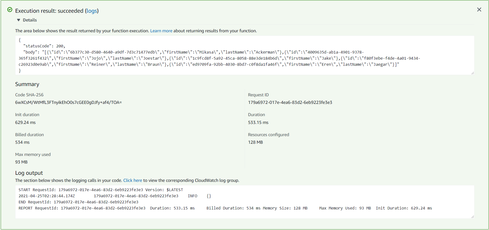
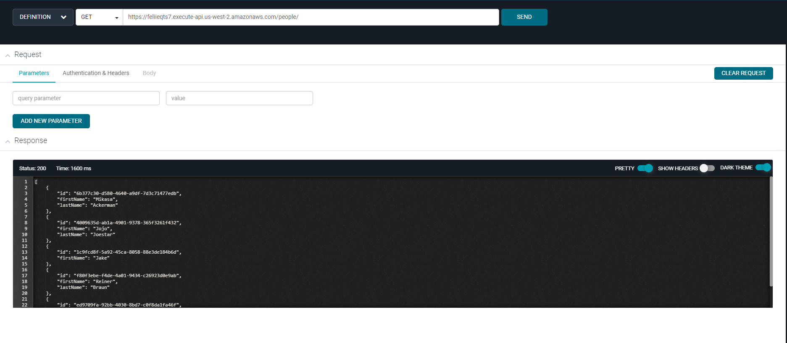

# Lambda Read

Lambda function uploaded on AWS, that gets person model from DynamoDB on AWS.

API base URL: https://feliieqts7.execute-api.us-west-2.amazonaws.com/people/

##Endpoints

- GET /people - returns a an array of all the person that exist in the DB.
- GET /people/{id} - returns a specidific person object based on id that's passed through.

## Tests

